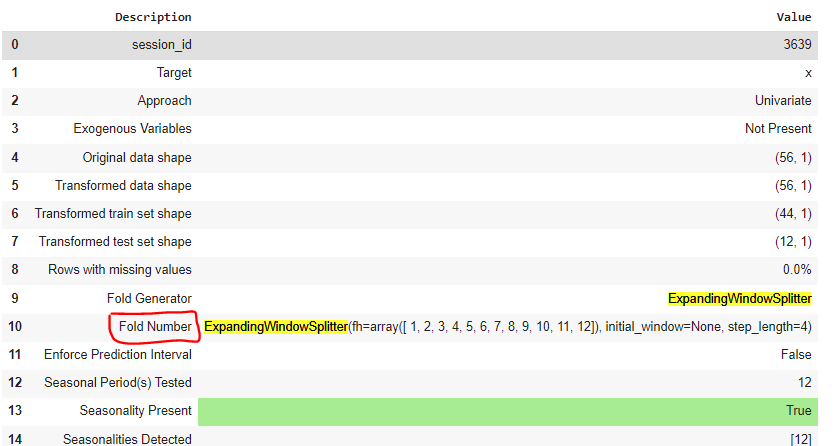

### Explanation of the Bug, and Fix in PyCaret Issue #3011
Authors: Arpon, Sinha, and Sizar

#### Issue Summary
The original issue, [PyCaret Issue #3011](https://github.com/pycaret/pycaret/issues/3011), involved the `Fold Number` field displaying the entire `ExpandingWindowSplitter` object instead of the actual fold count in the setup summary when using certain cross-validation (CV) strategies in `pycaret.time_series`. Users expected a simple number indicating the count of folds, not a complex object reference, which made the output confusing.  



#### Reproducing the Issue

The issue was reproduced using this code:

```python
import numpy as np
from pycaret.time_series import TSForecastingExperiment
from pycaret.datasets import get_data
from sktime.forecasting.model_selection import ExpandingWindowSplitter

# Load dataset
y = get_data(114, folder="time_series/seasonal", verbose=False)

# Define ExpandingWindowSplitter with a forecasting horizon of 12
cv = ExpandingWindowSplitter(fh=np.arange(1, 13), initial_window=24, step_length=4)

# Setup the experiment
exp = TSForecastingExperiment()
exp.setup(y, fh=12, fold=cv)
```

##### Dataset and Cross-Validation Setup

- **Dataset**: `get_data(114, folder="time_series/seasonal")` returns a time series [dataset with 171 data points](https://github.com/bennColl-cs4387/sizar/blob/main/group-fix/dataset_114.csv). 
- **ExpandingWindowSplitter**: Expands the training window by a fixed step each fold:
  - `initial_window=24`: Initial training window size.
  - `step_length=4`: Adds 4 points to the training window in each fold.
  - `fh=np.arange(1, 13)`: Forecasting horizon, predicting the next 12 points.

The issue occurs because [`ExpandingWindowSplitter`](https://sktime-backup.readthedocs.io/en/v0.11.4/api_reference/auto_generated/sktime.forecasting.model_selection.ExpandingWindowSplitter.html) is an object that dynamically generates folds, and without extra calculation, `Fold Number` incorrectly shows the object reference instead of the count.

#### Root Cause

PyCaret's original setup method directly assigned the fold parameter (`self.fold`) to `fold_param`. While this worked for simpler integer-based folds, it didn’t handle objects like `ExpandingWindowSplitter`, which doesn’t store the fold count as a simple integer. Since `ExpandingWindowSplitter` generates folds based on the dataset’s length and cross-validation parameters, it needs additional calculation to determine the fold count.

#### Fix in `_set_fold_generator`

The `_set_fold_generator` function in the [oop.py](https://github.com/pycaret/pycaret/blob/97649adf8965fd02831c14982a48323b6ce7de4c/pycaret/time_series/forecasting/oop.py#L967) file under time_series/forecasting directory was modified to calculate the fold count for complex CV objects like `ExpandingWindowSplitter`.

#### Solution Code

```python
def _set_fold_generator(self) -> "TSForecastingExperiment":
    """Sets up the cross-validation fold generator for the training dataset."""
    possible_time_series_fold_strategies = ["expanding", "sliding", "rolling"]

    if not (
        self.fold_strategy in possible_time_series_fold_strategies
        or is_sklearn_cv_generator(self.fold_strategy)
    ):
        raise TypeError(
            "fold_strategy parameter must be either a sktime compatible CV generator "
            f"object or one of '{', '.join(possible_time_series_fold_strategies)}'."
        )

    if self.fold_strategy in possible_time_series_fold_strategies:
        # Calculate the fold_param based on splits
        self.fold_generator = self.get_fold_generator(fold=self.fold)
        self.fold_param = (
            self.fold_generator.get_n_splits(y=self.y_train)
            if hasattr(self.fold_generator, 'get_n_splits') else None  
        )
    else:
        self.fold_generator = self.fold_strategy
        self.fold_param = self.fold_generator.get_n_splits(y=self.y_train)

    return self
```

#### Explanation of the Solution

1. **Dynamic Fold Calculation**: The code calculates the number of folds using `get_n_splits(y=self.y_train)`, giving an integer that correctly represents the fold count.
2. **Compatibility Check**: Using `hasattr` ensures that the `get_n_splits` method exists on the `fold_generator`. If not, `fold_param` defaults to `None`.
3. **Clear Display**: This solution replaces the object reference with the actual number of folds in the summary, making the display user-friendly.

#### Fold Count Calculation Explained

With 171 data points:
1. **Initial Window**: Starts with 24 points (`initial_window=24`).
2. **Step Length**: Adds 4 points to the training window in each fold (`step_length=4`).
3. **Forecast Horizon**: Each fold predicts the next 12 points (`fh=12`).

By expanding the window with these parameters, the total number of folds that can fit into the dataset until only 12 points remain for forecasting is **31**.

#### Why This Fix Works

This solution calculates `fold_param` based on the actual number of splits for complex CV strategies, ensuring that `Fold Number` shows a clear, expected fold count rather than a reference to the splitting object. This provides accurate feedback to the user and makes the setup summary more intuitive.

#### Solution Discovery Process Summary

1. **Identifying the Issue**: Initial setup showed `Fold Number` as a CV object instead of a number.
2. **Debugging**: Added print statements to inspect `fold_param` and `fold_generator`.
3. **Researching Documentation**: Checked `ExpandingWindowSplitter` docs and found `get_n_splits(y=...)` returns the number of folds.
4. **Testing**: Confirmed the fix displayed the correct fold count with different CV strategies.

This update to PyCaret’s time series module ensures `Fold Number` displays the actual fold count, even with complex cross-validation objects.
